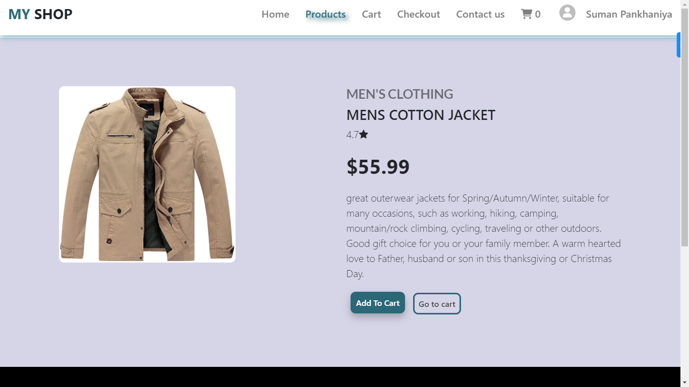

## Images of MY SHOP

# MY SHOP - ECommerce WebApp
Welcome to my Ecommerce WebApp repository! This project is a full-stack application built using React.js, Redux, Node.js, Express.js, and MongoDB. It features JWT Authentication, a complete purchase flow , adding items to the cart functionality using Redux, and sending emails with a bill upon placing an order and users can easily Download bill.

<!-- [link text](url)

 -->

## Features
- **User Authentication:** Users can create an account, log in, and log out securely.
- **Add to Cart Functionality:** Users can add any Product to their cart while browsing the available options..
- **Place Orders**: Once items are added to the cart, users can place orders securely.
- **Filtering**: Users can filter any Product based on different catagory (Men's Cloths , Women's cloths) and easy to explore their detailed description.
- **Search**: Users can search for specificproduct using the search functionality and explore their detailed description.
- **Redux Integration**: Redux is used for state management, providing a seamless user experience.

## Modules

## Technologies Used
- **Frontend**: 

  

- **Backend**: 

  

- **Database** : 

  

- **Authentication**: JWT (JSON Web Tokens)

## Installation
To run this project locally, follow these steps:

1. **Clone the Repository**
       
        git clone https://github.com/SHP05/My-Shop.git

2. **Install Dependencies**
       
        cd client
        npm install
        cd server
        npm install

3. **Setup your DB and SECRET KEY as per .env.example file in server**

4. **Start the Server**:
       
        npm run dev

5. **Start the client**:
       
        npm start

6. **Open your browser and navigate to http://localhost:3000 to start exploring HungryUp.**

## Usage
  - Register or login to your account.
  - Browse products, add items to the cart, and proceed to checkout.
  - Enter shipping details and complete the purchase.
  - Receive a confirmation email with the bill upon successful order placement.

## contribute
Contributions are welcome! Feel free to open an issue or submit a pull request. This project is now Under build so contribute and add your thoughts.

Thank you for checking out my Ecommerce WebApp! If you have any questions or suggestions, feel free to contact me. Happy shopping!